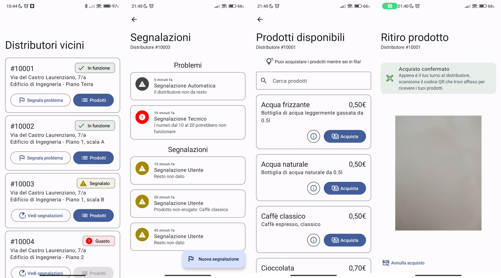

# BittaApp Prototype (HCI)
A simple Android app prototype. No real functionality other than UI/UX design prototype demo.

Built using **Jetpack Compose and Material 3**

This project was built for the `Human Computer Interaction` exam.

## Work material

All project material includes:
- research
- camera studies
- interviews
- user forms
- storyboards
- prototypes (on Figma and on paper)
- competitor analysis
- final report

It's all available in Italian language and it'll be uploaded to this repo soon.
Anyway, things like video and audio recordings won't ever be published here for privacy reasons.

## License (for the prototype app)

    Copyright 2022 Simone Sestito

    This program is free software: you can redistribute it and/or modify
    it under the terms of the GNU General Public License as published by
    the Free Software Foundation, either version 3 of the License, or
    (at your option) any later version.

    This program is distributed in the hope that it will be useful,
    but WITHOUT ANY WARRANTY; without even the implied warranty of
    MERCHANTABILITY or FITNESS FOR A PARTICULAR PURPOSE.  See the
    GNU General Public License for more details.

    You should have received a copy of the GNU General Public License
    along with this program.  If not, see <http://www.gnu.org/licenses/>.

